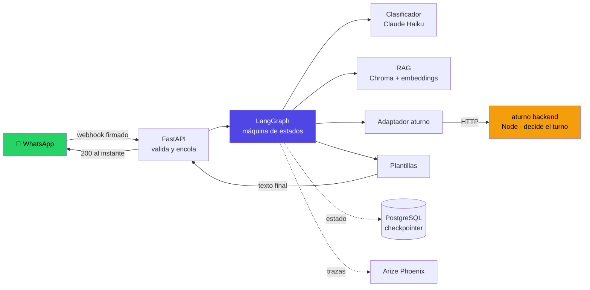
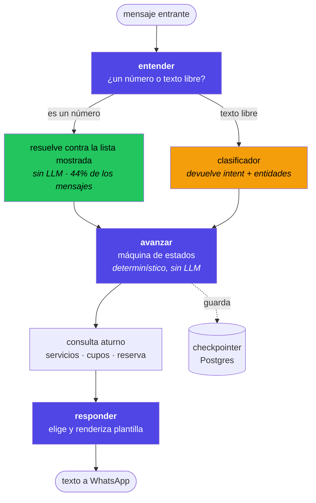
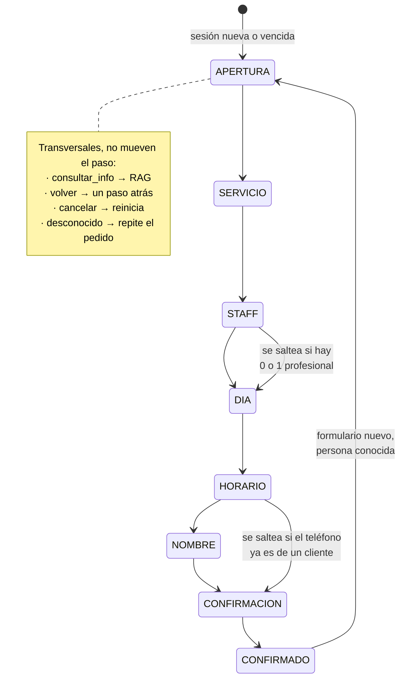

# aturno · capa conversacional de WhatsApp

Sacá un turno escribiéndole a un WhatsApp, como le escribirías a la peluquería.

En Argentina la gente ya pide turno por WhatsApp: manda un mensaje, alguien
contesta cuando puede, y se coordina a mano. Esto automatiza ese ida y vuelta
sin cambiarle el canal a nadie. Es una capa sobre [aturno](https://aturno.app),
un SaaS de turnos para negocios locales: el bot entiende lo que la persona
quiere, aturno decide si el turno se puede dar.

```
👤 hola
🤖 Hola Matías! Soy el asistente de Peluquería Demo.

   Esto es lo que hacemos:
   1. Corte de pelo — 30 min — $8.000
   2. Coloración — 90 min — $25.000
   3. Perfilado de barba — 20 min — $5.000

   Respondé con el número del servicio que querés.

👤 1
🤖 Corte de pelo. ¿Con quién lo querés?

   1. Lean
   2. Sofi
   3. Nico
   4. Me da igual
```

La segunda vez que escribís, ya sabe cómo te llamás.

---

## Arquitectura



**La lógica de turnos no se replica acá.** Disponibilidad, conflictos, bloqueos
y señas los decide el backend de aturno, que ya los tiene resueltos y testeados.
Este servicio entiende lo que la persona quiere y le pregunta si se puede.

---

## El grafo de agentes

Tres nodos, con una separación deliberada de responsabilidades:



**El LLM no redacta.** Clasifica intención y extrae datos; el texto que lee una
persona lo arma siempre una plantilla. Eso no es purismo: cuando el modelo
redactaba, en una tarde aparecieron el saludo cambiando de forma en cada
conversación, un listado horizontal y el siguiente vertical, los ids internos
filtrados al chat (`svc-corte | Corte de pelo | ...`) y un "¿necesitás algo
más?" que nadie pidió. Ninguno se arregla con más instrucciones: son
variaciones de un generador probabilístico.

---

## La máquina de estados

El mismo orden que la web. Nunca saltea hacia adelante; retroceder sí se puede.



Un dato que decide el costo: **si contestás "3", lo resuelve el código** contra
la misma lista que renderizó la plantilla. La mayoría de los mensajes de este
flujo son un número, y ninguno llega al modelo.

---

## Correrlo

```bash
git clone https://github.com/Mati2108/aturno-whatsapp && cd aturno-whatsapp
cp .env.example .env      # completar las claves
./run.sh
```

`run.sh` crea el entorno, instala, construye el índice del RAG y levanta el
servicio en `http://localhost:8000`. Con Docker:

```bash
docker compose up          # bot + Postgres + Phoenix
```

Para recibir mensajes reales hace falta exponer el webhook. En desarrollo:

```bash
cloudflared tunnel --url http://localhost:8000
# la URL que imprime va en PUBLIC_URL y en el webhook de Twilio
```

### Variables

| Variable | Para qué |
|---|---|
| `PROVIDER` | `anthropic` · `openai` · `gemini` · `ollama` |
| `ANTHROPIC_API_KEY` | El modelo del clasificador |
| `EMBEDDINGS_MODO` | `api` (sin memoria) · `local` (sin red, +805 MB) |
| `GEMINI_API_KEY` | Embeddings cuando el modo es `api` |
| `TWILIO_*` | Cuenta y número del sandbox |
| `PUBLIC_URL` | URL pública; con ella se valida la firma de Twilio |
| `DATABASE_URL` | Postgres del checkpointer |
| `PHOENIX_HABILITADO` | Prende el trazado |

---

## Tests

Verifican contra el estado real del sistema, no contra lo que el bot dice haber
hecho. Un bot que anuncia un turno sin reservarlo es peor que uno que falla.

```bash
python test_flujo.py            # 4 invariantes del flujo conversacional
python test_aislamiento.py      # el RAG no filtra datos entre negocios
python test_recuperacion.py     # relevancia del RAG, con umbral
python test_observabilidad.py   # 5 escenarios trazados de punta a punta
```

**`test_flujo.py`** — las cuatro propiedades que el diseño debe garantizar para
cualquier conversación:

| | |
|---|---|
| "hola" en tres momentos distintos | mismo texto, byte a byte |
| Todo listado | vertical, un ítem por línea |
| Toda respuesta | sin JSON, ids ni objetos crudos |
| Inputs que intentan saltear pasos | el orden se respeta |

**`test_aislamiento.py`** — el requisito que hace vendible un SaaS multi-tenant.
Le pregunta a la peluquería por obras sociales (dato que solo tiene el
consultorio) y verifica que no se filtre nada. Incluye que **no se pueda
construir un recuperador sin negocio**: el `business_id` va en el constructor,
no en la búsqueda, así que la consulta sin filtro no existe como posibilidad.

**`test_recuperacion.py`** — 12 preguntas reales con la sección que debería
responder cada una. Umbral de 85%; hoy da **12/12 en top-1**. Este archivo es el
que decidió cambiar de modelo de embeddings.

---

## Observabilidad

```bash
phoenix serve                                    # http://localhost:6006
PHOENIX_HABILITADO=true python test_observabilidad.py
```

Cada mensaje deja un árbol de spans: qué clasificó el modelo, qué nodo corrió,
qué trajo el RAG, qué contestó aturno, con tokens y latencia. Medido sobre 400
spans de los cinco escenarios:

| | |
|---|---|
| Mensajes procesados | 64 |
| Llamadas al modelo | 36 |
| **Resueltos sin LLM** | **28 (44%)** |
| Latencia mediana | 748 ms |
| Costo por turno reservado | **US$ 0,035** |

El trazado falla blando: si el colector no está, el bot avisa y sigue
atendiendo. Un sistema de observabilidad que tira abajo al que observa es peor
que no tenerlo.

---

## Decisiones de diseño

Casi todas salieron de un bug real, no de una preferencia.

### El modelo no calcula fechas

Se le pidió "el lunes que viene" y resolvió **2026-08-23, que era domingo** —
con el negocio cerrado. El turno se reservó igual. Ahora el prompt lleva una
tabla de los próximos diez días ya resueltos, generada en código. La aritmética
es determinística y va en código; al modelo le queda entender a qué día se
refiere alguien cuando escribe "el finde".

### El modelo de embeddings se eligió midiendo

Ocho preguntas en español, cada una con la sección que debería responder:

| Modelo | top-1 | Problema |
|---|---|---|
| `nomic-embed-text` | 4/8 | Fallaba en *"cuánto cuesta un corte"*, la pregunta más común. Entrenado sobre todo en inglés |
| `bge-m3` (Ollama) | 8/8 | Necesita un demonio de 1,2 GB |
| `fastembed` en proceso | 8/8 | +805 MB de RAM |
| **Gemini por API** | **8/8** | — |

El primero habría salido a producción sin poder contestar cuánto sale un corte.

### La memoria decidió el despliegue

| | |
|---|---|
| python + fastapi + langgraph + chroma | 157 MB |
| + modelo de embeddings local cargado | **962 MB** |

Los 805 MB son el runtime de ONNX; limitarle hilos y arenas no los baja. Un
plan chico de hosting tiene 512 MB — y el plan pago del mismo proveedor
también, así que pagar no resolvía nada. Con embeddings por API el proceso baja
a **173 MB**. Lo local queda como opción: un consultorio que no quiera que los
datos de sus pacientes salgan de su servidor pone `EMBEDDINGS_MODO=local` y
paga esa memoria a propósito.

### El webhook contesta vacío

Twilio corta si el webhook demora y reintenta, y la persona recibe todo dos
veces. Un turno del sistema tarda segundos, así que la respuesta no puede
viajar en el cuerpo del webhook: se devuelve 200 al instante y la respuesta sale
después como mensaje nuevo por la API REST.

### El aislamiento entre negocios es estructural

El `business_id` está en el constructor del `Recuperador`, no en la búsqueda.
No existe forma de escribir una consulta sin filtro: para buscar hay que decir
primero de qué negocio sos. Un parámetro `filtro=` opcional es exactamente el
bug que este diseño hace imposible.

### Los días cerrados no llevan número

Numerarlos ofrece una opción que al tocarla rebota. Se muestran —para que se
vea la forma de la semana— pero solo se numera lo reservable.

### El único camino real al rechazo es una carrera

El sistema nunca ofrece un horario ocupado, así que el rechazo por
"ya está tomado" solo puede ocurrir si alguien reserva desde la web **entre**
que el bot ofrece el horario y la persona confirma. El test lo reproduce
exactamente así.

---

## Estructura

```
src/
  api/webhook.py        recibe de Twilio, valida firma, encola
  agentes/
    flujo.py            el grafo: entender → avanzar → responder
    estados.py          estados, transiciones, resolución de números
    clasificador.py     el único lugar donde interviene el LLM
  aturno/
    base.py             contrato con aturno
    doble.py            implementación en memoria (desarrollo y plan B)
  rag/indice.py         Chroma con aislamiento por negocio
  plantillas.py         TODO lo que el usuario lee
  schemas.py            contratos Pydantic
  modelo.py             selector de proveedor de LLM
  observabilidad.py     trazado con Phoenix
datos/                  un .md por negocio; el nombre es el business_id
```

**Stack:** Python 3.12 · LangGraph · LangChain · Pydantic · FastAPI ·
PostgreSQL · Chroma · Claude Haiku 4.5 · Twilio · Arize Phoenix

---

## Estado y límites

Funciona de punta a punta y está desplegado. Lo que todavía no hace:

- **Habla con un doble de aturno, no con el backend real.** El contrato está
  definido y el adaptador tiene las dos implementaciones; falta conectar la
  segunda (`ATURNO_MODO=api`).
- **Un solo número de WhatsApp.** El ruteo por negocio está hecho —sale del
  campo `To` del webhook— pero el sandbox de Twilio da un número único.
- **No cancela ni reprograma.** Alcance recortado a propósito: aturno ya lo
  resuelve, y un bot que hace una cosa bien vale más que uno que hace cinco a
  medias.
